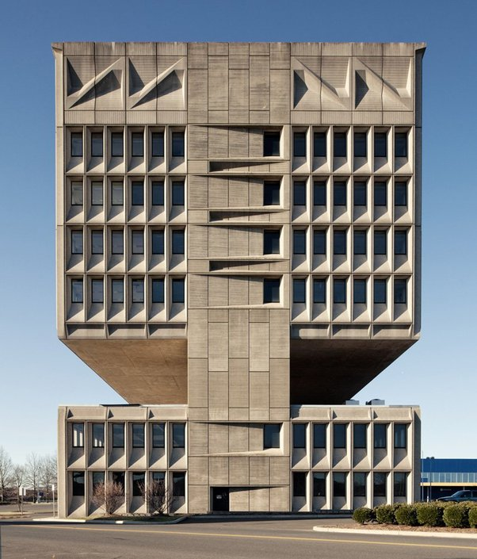
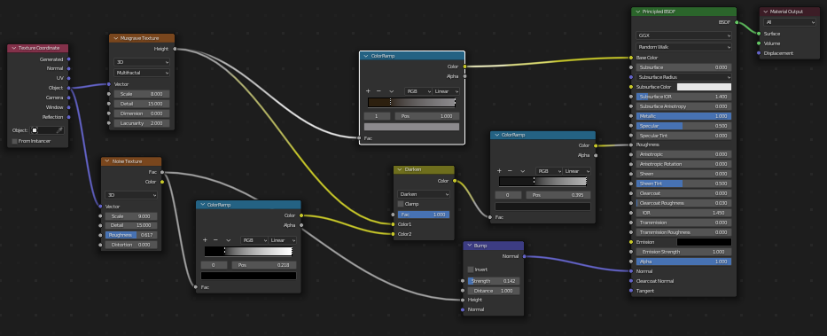
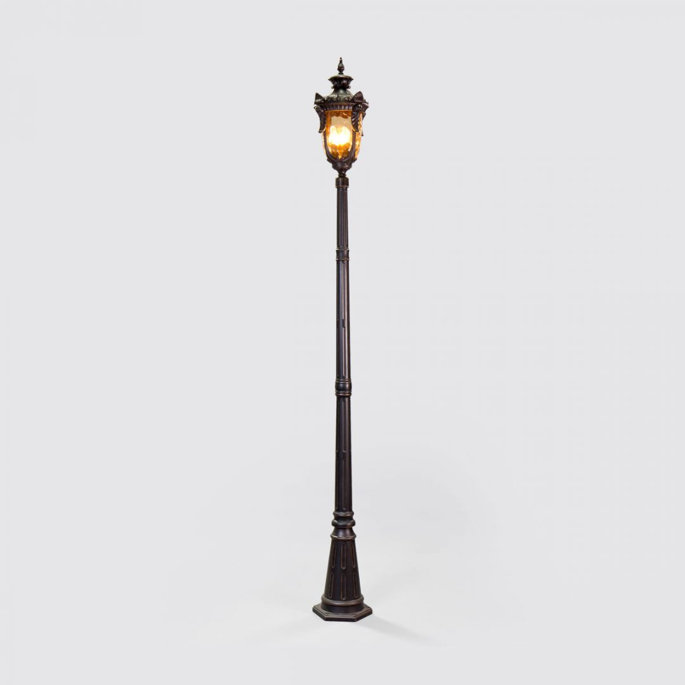
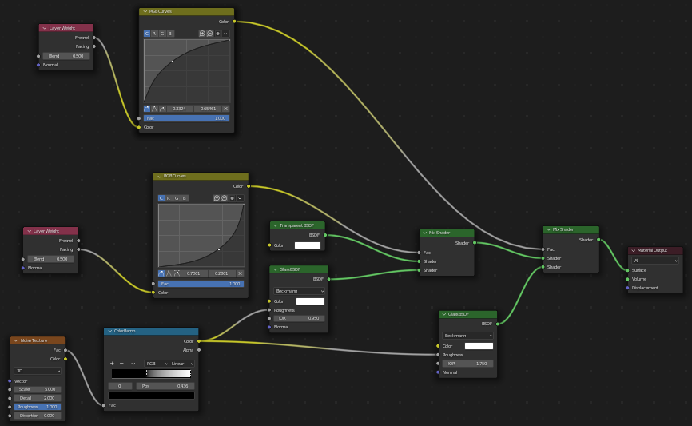
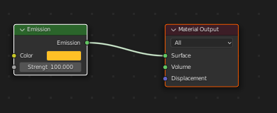
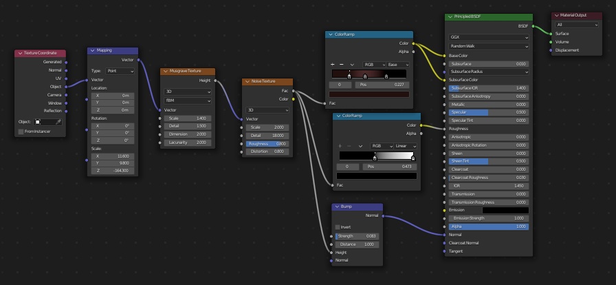
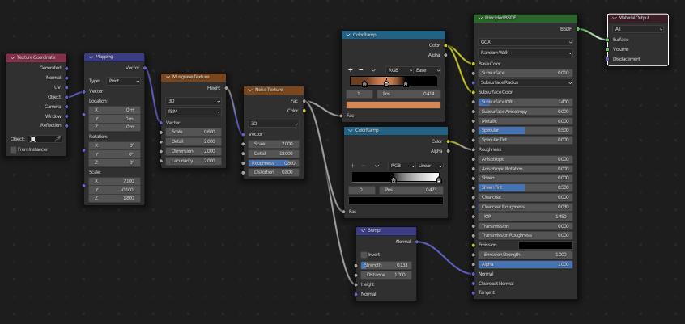
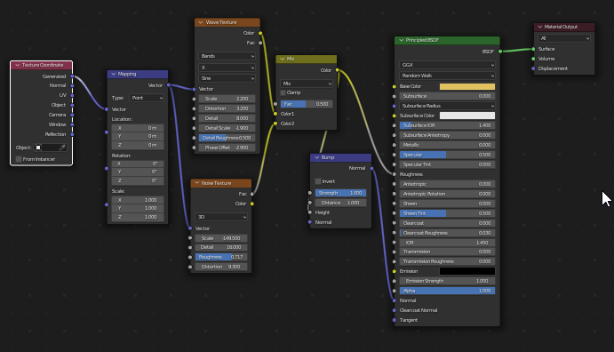

The Project I have made in Blender is of a Post-Apocalyptic Dystopian environment, in which a sandstorm has destroyed a city and now it is covered in sand with buildings in the sand all weathered and damaged. A small unmanned ship goes around the area to find if there are any survivours or any supplies to take.

Modelling Process: 
For the overall scene and environment, the idea was inspired by the movies Dune and Star Wars, mainly the scene in tatooine. I Set up the scene to look as chaotic and as random as possible with Streetlights half covered in sand, and electricity poles and buildings covered in sand. I chose a sunset scene to help emphasise the shadows casted by the buildings onto the sand to display how apocalyptic the scene is seen, with dim streetlights reflecting on the weathered steel. For the buildings, it was done by subdividing a cube and manipulating it so that parts of its face/vertices were missing to highlight the damage done to the building over time as well as creating a weathered metal texture through the use of nodes, to again show the damage done to the buildings.

Models:
Electrical Post -> For modelling an electrical post, I played around with the modelling and took some ideas from electrical generators, focusing on the metal coil that juts out where the electrical wire would be held. I played around with multiple cubes and cylinders with mirror effect to help speed up the process. For the material, i decided to go with a basic principled bsdf material with metallic condition. 

Buildings -> For modelling these buildings, I modelled it based on brutalist architecture , with some sculpting and dissolving of the edges and faces of the buildings to help show the weathering made by the sand over time. The weathered metal was created using nodes. 

Lamp Posts -> For the lamp posts, i originally designed it with inspiration from old victorian lamp post designs , but with a modern design. The top of it is made of glass with the texture applied i created  and a sphere was placed inside with a emission material to create lighting for the lamp. 

Space Ship -> for the space ship, i originally designed the design itself, with for the wings, i extruded the vertices to create it. I also applied a window cockpit using the window texture i created. 

WindMill -> for the windmill, i was inspired by the old barn style windmills, and a wood texture was applied to the base and for blades, it was a simple plane manipulated and duplicated to create it.

House -> for the house, the original idea was to model a house, and such i used the house model i had originally created and put it in the scene. I modelled this using multiple basic cubes and using extrusions and vertices manipulation in edit mode to create the over shape and design of the house. Then i cut holes in the cube to make way for the windows. Which a texture was applied made by using nodes. The reference for this idea was just a simple suburban house design. Then a wood texture i created again with nodes was first used for the exterior of the house  and another different wood texture to model the inside of the house was also made.  

Sand Dunes -> The Sand dunes were done by adding modifiers to the plane such as the displace and subdivision surface as well as applying a texture made using nodes, such as noise texture and voronoi texture to help create the sand dune effect of the plane.

Materials:
The materials used were a mix of simple and more detailed, for the buildings i used a weathered metal texture i created with the help of online resources as well as the sand dune texture in the scene. For the house, and windmill, a wood texture also created by myself through online resources and nodes, was used to add more detail to the abandoned house. The house's windows were also created by adding transparency node onto the material to help create a window material.

Render Output:
I used cycles to render my scene with 4096 samples to ensure that all the small details are retained. I also used a sky texture for the background, the nishita sky texture to get the effect of a sunset casting rays onto the sand to help it look more realistic, as well as the shadows. For the final scene render, i used a 76mm sensor with 45mm lens to help capture as much of the scene without losing too much detail or distortion of the overall scene. 
